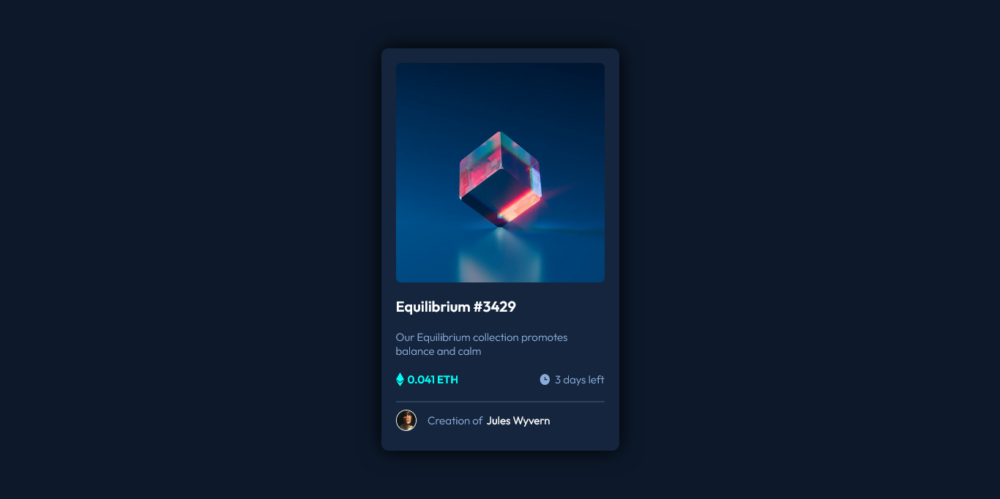

# Frontend Mentor - NFT preview card component solution

This is a solution to the [NFT preview card component challenge on Frontend Mentor](https://www.frontendmentor.io/challenges/nft-preview-card-component-SbdUL_w0U). Frontend Mentor challenges help you improve your coding skills by building realistic projects. 

## Table of contents

- [Overview](#overview)
  - [Screenshot](#screenshot)
  - [Links](#links)
- [My process](#my-process)
  - [Built with](#built-with)
  - [Continued development](#continued-development)
  - [Useful resources](#useful-resources)
- [Author](#author)

## Overview

### Screenshot

### Links
- Live Site URL: [View Site](https://nano1104.github.io/nftcard-preview/)
 
## My process
- The first I did was start looking for how to use github pages. 
I had a little trouble as I could not use a custom domain 
(because of my DNS provider) so I just used the default domain

- Once I finished that I structured the card with HTML. Then aplied the styles
given by the "style-guide".

- I kept on giving styles. I had doubts about the
font-size of the paragraph, the style-guide said that it must be 18px but I put 15px 
as I considered that it looked more similar to the card given.

- I aplied the active states (hover). I had trouble with the one of the img, 
I did it in the best way I could (for me the best way would be with js) but it doesn't look 100% exactly
as the one given, the clock icon has transparency. if someone coudl help with this, would be great!

- Considering  the Responsive Mobile I thought it was not necesary to use (maybe I'm wrong), I saw
that it looked good in 375px without using any breakpoint.

### Built with
- Semantic HTML5 markup
- CSS custom properties
- Flexbox

### Continued development
- I'd like to learn more advance hover effects in CSS and practice I little bit more of Responsive Design. 

- Also it'd be useful for me practising or learning a bit of node.js.

### Useful resources
- [Youtube - DesrrolloWeb.com](https://www.youtube.com/watch?v=nbUR1jzVI5g&t=375s) - This guy helped to understand
how to configured a custom domain for github pages. Also I saw that the I had a problem in my DNS provider so I
couldn't changed it. 

## Author

- Linkedin - [Mariano Gil](https://www.linkedin.com/in/mariano-gil-24740620b/)
- Frontend Mentor - [@Nano1104](https://www.frontendmentor.io/profile/Nano1104)
